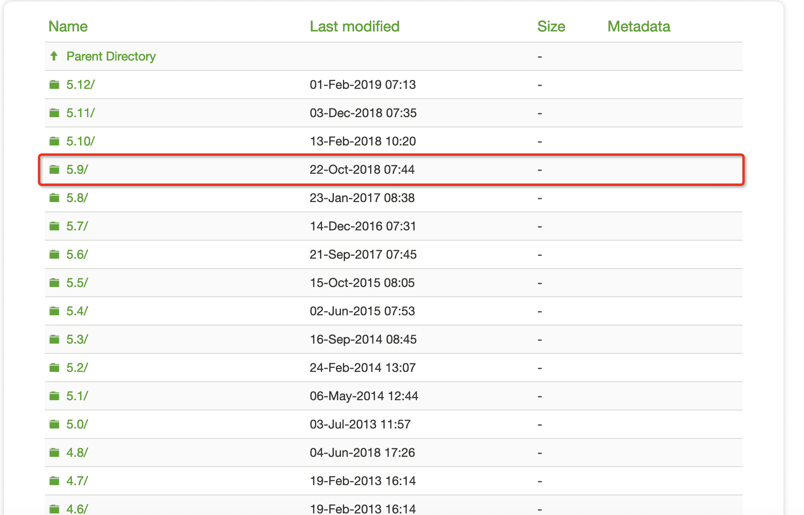
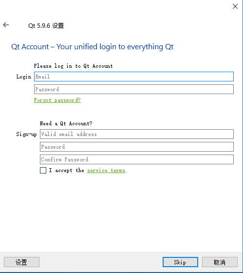

# 前沿
本章主要介绍如何下载QT，和下载需要注意的细节

> [下载网址](http://download.qt.io/)

网站比较慢，需要耐心等待

> qtcreator是qt的ide，每个版本的qt都对应一个版本的qtcreator，因为我们这里下载的qt版本，会附带qtcreator，所以这里不用理会

> 这里我选择下载5.9.6版本的，低版本的下载安装与这里介绍的版本有很大的不同，这里我就不详细介绍了，之所以这里选择5.9.6，是因为一开始我选择了5.12，后来在开发中，在使用qt quick的托盘组件时，发现无法正常唤起托盘，因本人能力有限，实在无法找到具体原因，在回退版本到5.9.6后发现一切都正常了，所以这里我选择我比较熟悉的5.9.6

* [mac安装]()
* [window]()

# window

> 先讲window的安装，window的比较简单，也好讲

> 选择skip，跳过该过程

> 然后下一步，然后选择安装目录

> 这里我们勾选了MinGW，Sources，和Qt Creator Debugger ，在组件模块中，你可以根据需求勾选自己用到的，当然如果你不知道你可能会用到哪个，你也可以把全部组件勾选上，下面我会把各个模块具体介绍一下

> 编译器模块

* MinGW编译器模块，具体概念你们自己百度，这里我只说QT相关的，该编译器允许你在各个平台编译你的QT程序，真正可以做到一个项目编译多个平台，而不会出现奇奇怪怪的bug，本项目我们选该编译器，就是为了方便同时编译mac和window平台,不过这里有个**需要注意**的,如果你的项目中用到webview(QT自带的webview，即WebenGine)，那window系统的，只能下载msvc编译器了，因为从4.几(忘记是几了)版本开始就不支持了

* UWP编译器模块，UWP 是 Windows 10 中 Universal Windows Platform 的简称，有不同编译器类型的 UWP。没用过，这里就不说了

* MSVC编译器模块，具体概念也是你们自己去百度，这里我也只说QT相关的，该编译器我们只能用于编译window系统，这里**需要注意**的，要安装 MSVC 编译器的模块，需要计算机上已经安装相应版本的 Visual Studio，比如你勾选了msvc2015，那你就需要在电脑里下载安装visual studio 2015，这里我就不做msvc教程了，无非是去官网下载个visual studio，如果出现什么配置问题(一般不会)，自己再想办法解决吧

* Android，用于编程android的，这里要说的是，在我们教程中使用到的qt quick，其本意就是为了开发移动端的，所以你们如果有兴趣，可以自己去研究研究

> 组件模块

* Qt Charts 是二维图表
* Qt Data Visulization 是三维图表
* Qt Purchasing 是提供了一套商店购买API，可以将你的app发布到这些应用商店。支持iOS中的App Store和Android中Google Play。
* Qt Virtual Keyboard 提供了一个可扩展的虚拟键盘，支持触屏
* Qt WebEngine 提供webview的
* Qt Network Auth(TP)，Qt Remote Objects(TP)，Qt Speech(TP)，括号里的 TP 表示技术预览（Technology Preview）
* Qt Scritp（Deprecated）是脚本模块，括号里的“Deprecated”表示这是已经过时的模块

> 工具模块

* MinGW 5.3.0 是 MinGW 编译工具链
* Strawberry Perl 是一个 Perl 语言工具

