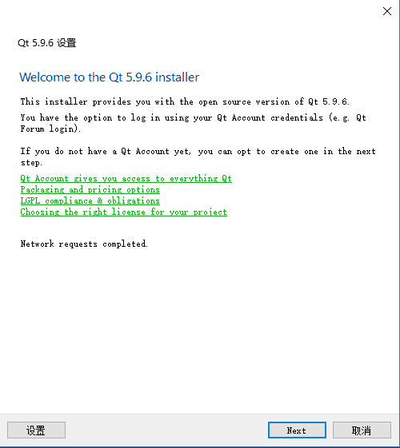
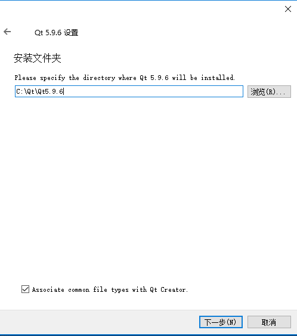

# 前沿
本章主要介绍如何下载QT，和下载需要注意的细节

> [下载网址](http://download.qt.io/)

网站比较慢，需要耐心等待

> qtcreator是qt的ide，每个版本的qt都对应一个版本的qtcreator，因为我们这里下载的qt版本，会附带qtcreator，所以这里不用理会

> 这里我选择下载5.9.6版本的，低版本的下载安装与这里介绍的版本有很大的不同，这里我就不详细介绍了，之所以这里选择5.9.6，是因为一开始我选择了5.12，后来在开发中，在使用qt quick的托盘组件时，发现无法正常唤起托盘，因本人能力有限，实在无法找到具体原因，在回退版本到5.9.6后发现一切都正常了，所以这里我选择我比较熟悉的5.9.6

* [mac安装]()
* [window]()

# window

> 先讲window的安装，window的比较简单，也好讲

> 选择skip，跳过该过程

> 然后下一步，然后选择安装目录

> 这里我们勾选了MinGW，Sources，和Qt Creator Debugger ，在组件模块中，你可以根据需求勾选自己用到的，当然如果你不知道你可能会用到哪个，你也可以把全部组件勾选上，下面我会把各个模块具体介绍一下

> 这里稍微介绍一下编译器模块

* MinGW编译器模块，具体概念你们自己百度，这里我只说QT相关的，该编译器允许你在各个平台编译你的QT程序，真正可以做到一个项目编译多个平台，而不会出现奇奇怪怪的bug，本项目我们选该编译器，就是为了方便同时编译mac和window平台,不过这里有个**需要注意**的,如果你的项目中用到webview

