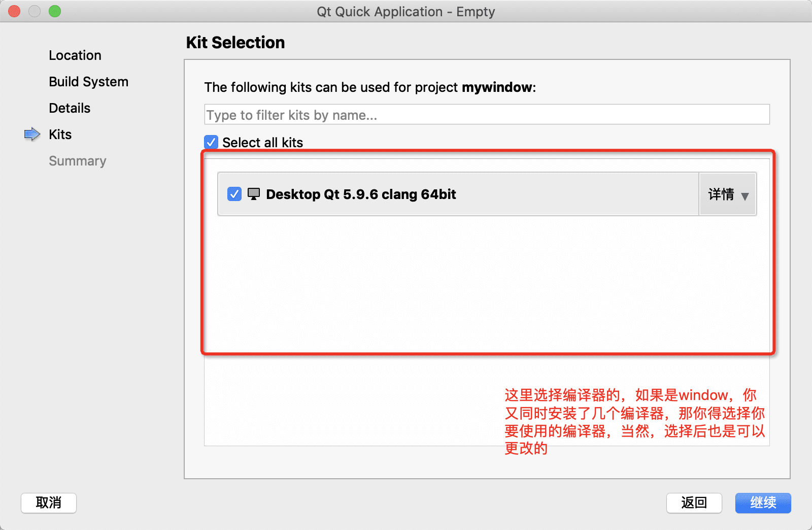

# 前言
本章主要介绍qt creator和创建一个helloword

----

#### 打开QtCreator





#### 了解一下Qt Creator


mac电脑的qt creator设置界面入口

window电脑的qt creator设置界面入口


#### 创建hello world

* 打开main.qml文件

在其内部添加如下代码

```javascript
Text{
        width:parent.width 
        height:parent.height
        text:"Hello World"
        color:"#f66"
        font.pixelSize: 60
        verticalAlignment: Text.AlignVCenter
        horizontalAlignment: Text.AlignHCenter
    }
```


然后我们就可以看到我们的软件打开了，至此我们的helloworld就完成了


> 编译好的文件

这个时候，你就会看到你的项目文件夹的上一层目录出现一个文件夹，文件夹名是`build-项目名-Desktop...-Debug(如果是release编译，那这个名字就是release)`

* mac:


mac的打开该文件夹，就可以看到编译好的app，双击app，发现可以打开软件。这里**注意了**，不要以为这个软件就可以用了，你发给别人试试，就会发现打不开，为什么呢，因为还没有加入依赖，在你的电脑能打开是因为它动态指向本机上依赖，至于打包依赖上线那是以后再说的事情了，mac打包是最简单也是最难的，至于为什么，就得看你的需求了，要不要codesign，有没有调用需要授权的功能等等

* window:


window的打开，因为我们打包的是debug，所以双击debug文件夹，也能看到编译好的exe，不过我们打不开，因为缺少各种dll，以后怎么加入这些东西，我们以后再说，如果只是想双击能打开，可以设置全局环境，这里不介绍了，自己如果需要自己百度去。这里也加个**注意**，我们编译的exe是放到debug文件夹，但是我们每次编译完成后自动打开软件，它的*运行环境*却是debug目录*的上一个目录*，对，不是debug里面这个目录，是`build-helloworld-Desktop_Qt_5_9_6_MinGW_32bit-Debug`这个目录，如果c++或则项目中引入第三方库或者图片等(不包含qml中的，因为加入qml中的图片等资源，我们会在qml.qrc(qml的文件管理)中声明了，在编译的时候会被自动编译到程序中)，需要放到`build-helloworld-Desktop_Qt_5_9_6_MinGW_32bit-Debug`目录中，不然运行程序时程序会找不到这些资源。